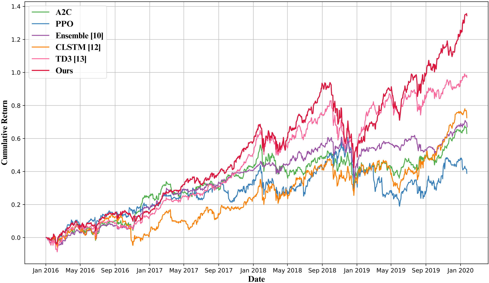
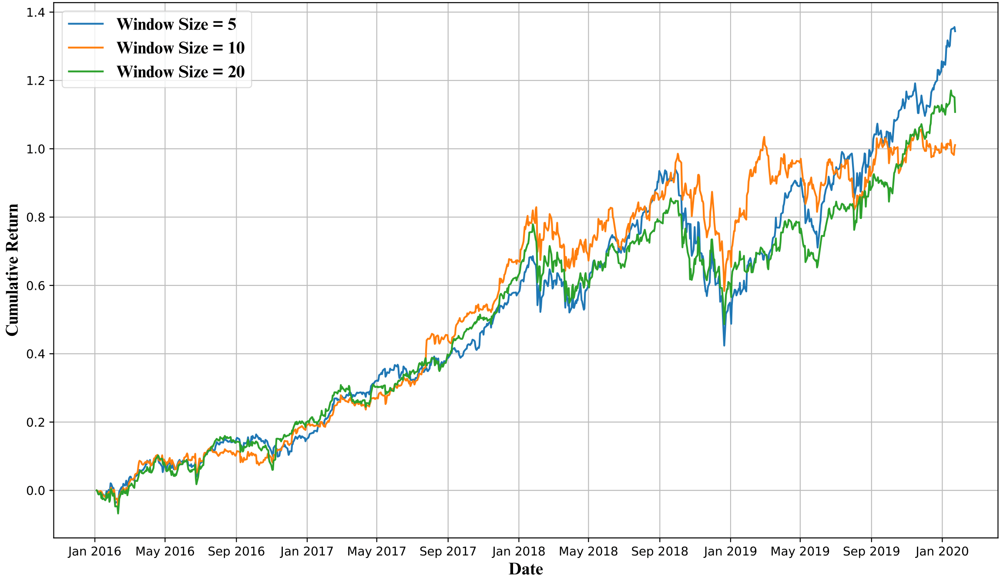
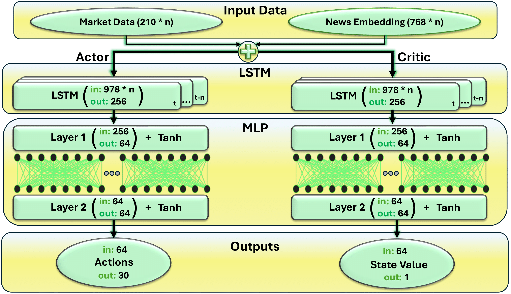
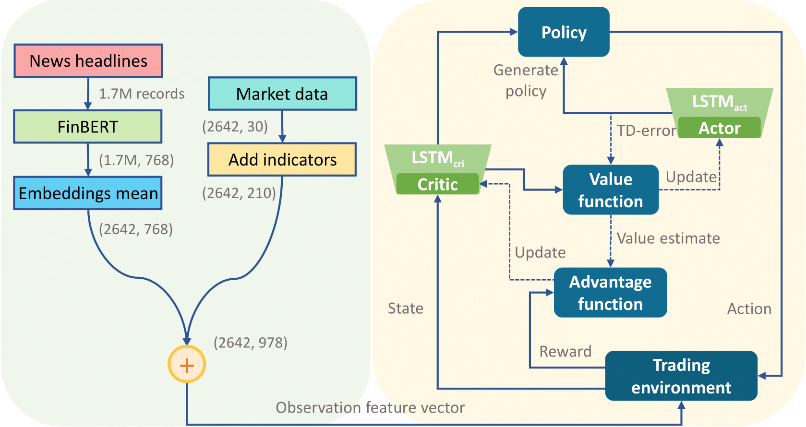

# LSTMppo-DRL-StockTrade

### A Deep Reinforcement Learning Approach Combining Technical and Fundamental Analyses with a Large Language Model for Stock Trading

<!-- 2×2 table of figures (PDF files in the `asset` folder). -->
| **Figure 1: Cumulative Returns Plot** | **Figure 2: Hyperparameter Set 5 (window test)** |
| --- | --- |
| [](asset/cumulative_returns_plot.png) | [](asset/Hyperparameter_Set_5.png) |

| **Figure 3: Neural Architecture** | **Figure 4: State Architecture** |
| --- | --- |
| [](asset/Neural_Architecture.png) | [](asset/State_Architecture.png) |

This is the official GitHub repository for **LSTMppo-DRL-StockTrade**. It implements a Deep Reinforcement Learning (DRL) system for automated stock trading, combining technical and fundamental analyses (via sentiment from a large language model). The project is associated with our paper published in **[IEEE ICCKE 2024](https://ieeexplore.ieee.org/document/10874515)**:

---

## Latest
- `02/27/2025`: Added the main notebook (`MAIN(A_Deep_Reinforcement_Learning_Approach_Combining_Technical_and_Fundamental_Analyses_with_a_Large_Language_Model_for_Stock_Trading)`) and the figures (see above). The only remaining task is to clean and structure the code.
- `02/21/2025`: The paper is now published in IEEE ICCKE 2024.
- `10/07/2024`: The repository was created.

---

## Paper
**Title**: A Deep Reinforcement Learning Approach Combining Technical and Fundamental Analyses with a Large Language Model for Stock Trading  
**Authors**: [Mahan Veisi](https://github.com/MahanVeisi8), [Sadra Berangi](https://github.com/sadraberangi), [Mahdi Shahbazi Khojasteh](https://github.com/MehdiShahbazi), and Armin Salimi-Badr  

**Link to IEEE Xplore**:  
[https://ieeexplore.ieee.org/document/10874515](https://ieeexplore.ieee.org/document/10874515)

### Abstract
Stock trading strategies are essential for successful investment, yet developing a profitable approach is challenging due to the stock market’s complex and dynamic nature. This paper introduces a Deep Reinforcement Learning (DRL) framework for automated stock trading that integrates technical and fundamental analyses with a large language model. We model the trading environment as a Partially Observable Markov Decision Process (POMDP) and propose a hybrid architecture that combines Long Short-Term Memory (LSTM) with Proximal Policy Optimization (PPO) to capture intricate temporal patterns in stock data and make informed trading decisions. Our model incorporates market indicators alongside financial news headlines, processed through the FinBERT language model, to create a rich state representation. Additionally, we integrate a drawdown penalty into the reward function to further improve portfolio stability. Evaluations on a dataset of 30 U.S. stocks demonstrate that our model outperforms benchmarks in cumulative return, maximum earning rate, and Sharpe ratio, indicating that the hybrid approach yields more resilient and profitable trading strategies than existing methods.

---

## Method
Our DRL approach leverages:
1. **LSTM** to capture long-term dependencies and temporal patterns in stock price data.
2. **PPO** for stable and efficient policy updates.
3. **FinBERT** for sentiment analysis on financial news, enabling a rich fundamental-state representation.
4. A **drawdown penalty** in the reward function to enhance portfolio stability.

---

## Installation

> **Note**: The code is still under preparation. We will release the complete source code and additional installation instructions soon.

In the meantime, if you want to prepare your environment in advance, you can install the essential dependencies as follows:

```bash
# Step 1: Create a virtual environment:
micromamba create -n lstmppo-drl python=3.9 -y
# or 
conda create -n lstmppo-drl python=3.9 -y

# Step 2: Activate the virtual environment:
micromamba activate lstmppo-drl
# or
conda activate lstmppo-drl

# Step 3: Install the required libraries from the requirements file (will be provided soon):
pip install -r requirements.txt
```

---

## Datasets
- **Stock Price Data**: Sourced from [Yahoo Finance](https://finance.yahoo.com/).
- **News Data**: Collected from [Benzinga](https://www.benzinga.com/).
- **Sentiment Analysis**: Conducted using [FinBERT](https://huggingface.co/yiyanghkust/finbert-tone).

We will provide specific dataset details and preprocessing scripts once the repository is fully updated.

---

## Citation
If you find this repository or our paper helpful in your research or project, please consider citing the paper and giving a ⭐ to the repository.

<details>
  <summary>Click to view BibTeX</summary>

```bibtex
@INPROCEEDINGS{10874515,
  author={Veisi, Mahan and Berangi, Sadra and Khojasteh, Mahdi Shahbazi and Salimi-Badr, Armin},
  booktitle={2024 14th International Conference on Computer and Knowledge Engineering (ICCKE)}, 
  title={A Deep Reinforcement Learning Approach Combining Technical and Fundamental Analyses with a Large Language Model for Stock Trading}, 
  year={2024},
  volume={},
  number={},
  pages={224-229},
  keywords={Social networking (online);Large language models;Computational modeling;Soft sensors;Deep reinforcement learning;Data models;Stability analysis;Long short term memory;Portfolios;Optimization;Deep reinforcement learning;proximal policy optimization;large language model;automated stock trading;financial markets},
  doi={10.1109/ICCKE65377.2024.10874515}}
```
</details>

---

## Acknowledgements
This framework was inspired by [Stable-Baselines3](https://github.com/DLR-RM/stable-baselines3) for reinforcement learning and [FinBERT](https://huggingface.co/yiyanghkust/finbert-tone) for sentiment analysis.

Stay tuned for updates, and thank you for your interest in **LSTMppo-DRL-StockTrade**!
